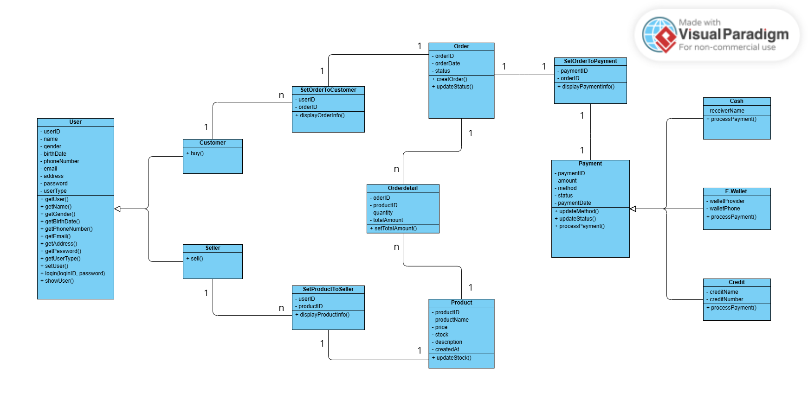
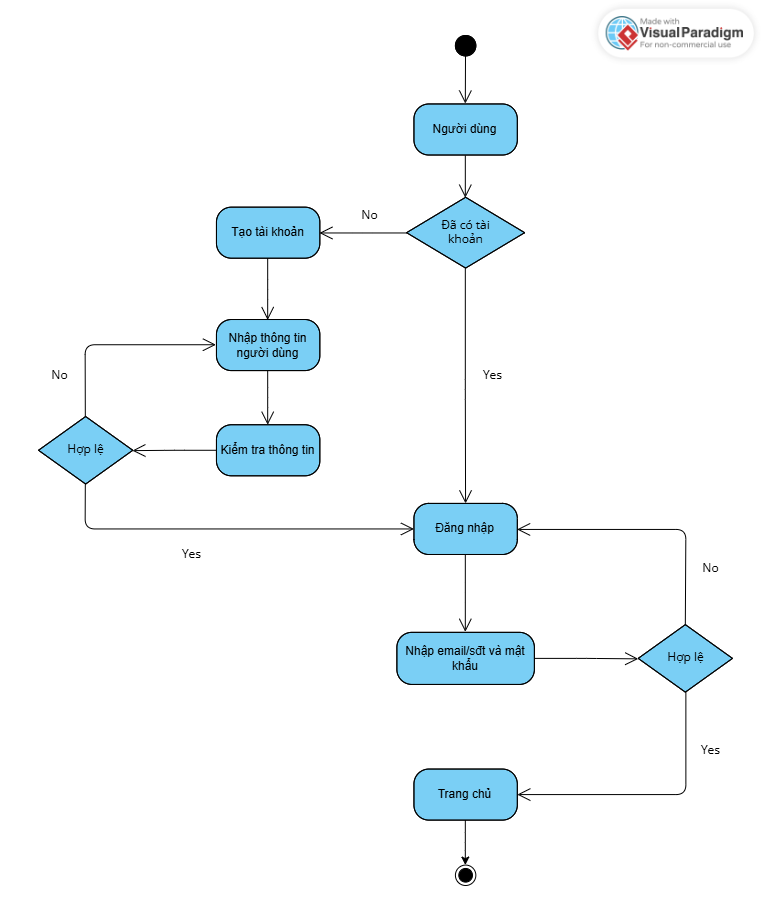
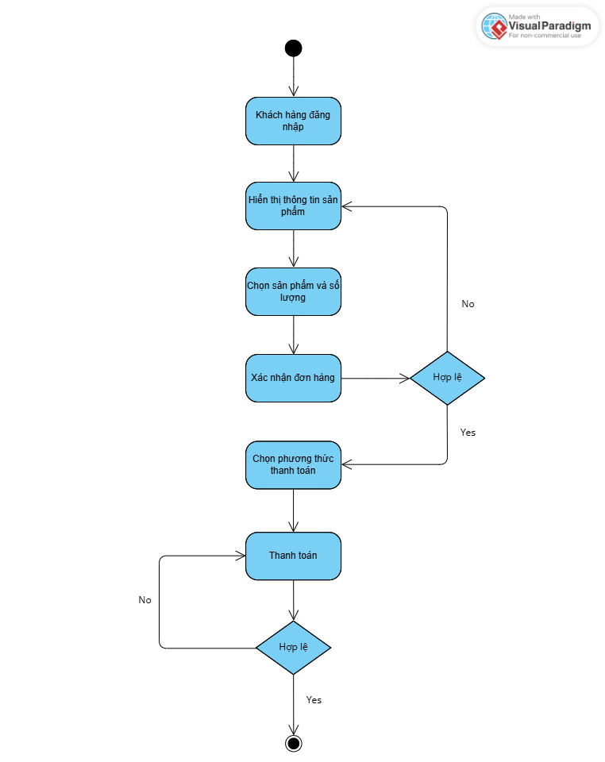
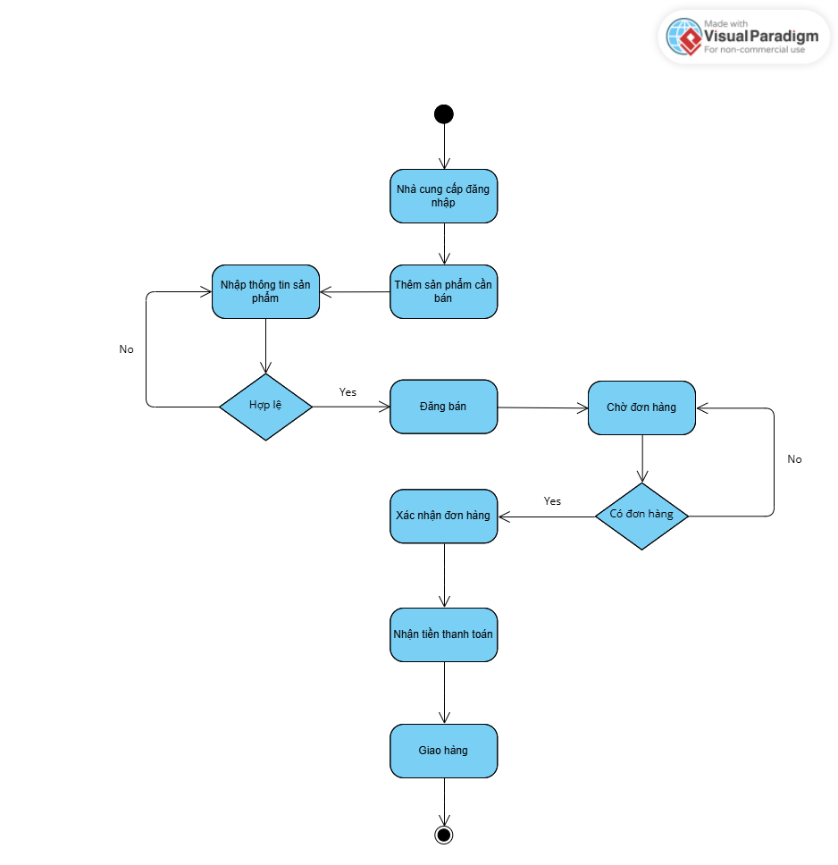
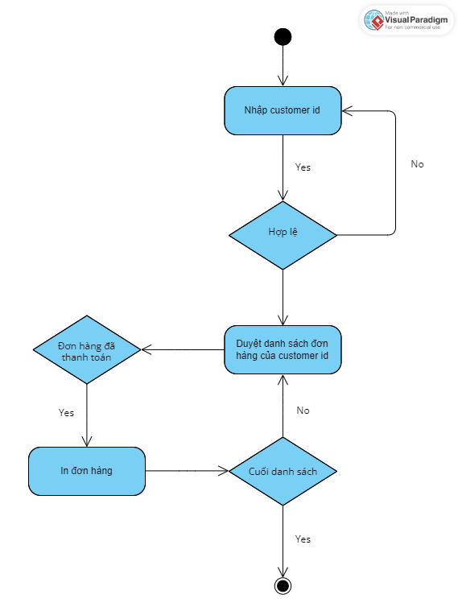

# 🐝 Shopbee – Hệ thống mua bán hàng trực tuyến

> **Dự án cuối kỳ môn Lập trình Hướng Đối Tượng (OOP)**  
> Nhóm 5 – K17 – Term 3 – Năm học 2025  
> Giảng viên hướng dẫn: TS. Nguyễn Lệ Thu

---

## 📌 Giới thiệu
**Shopbee** là một ứng dụng mô phỏng hệ thống mua bán hàng trực tuyến với đầy đủ các chức năng: quản lý người dùng, sản phẩm, đơn hàng và thanh toán. Giao diện console viết bằng Java, ứng dụng sử dụng mô hình hướng đối tượng, lưu trữ dữ liệu bằng file nhị phân và thao tác với các cấu trúc dữ liệu như `ArrayList`.

---

## 👥 Thành viên nhóm
| STT | Họ tên               | GitHub                                               |
|-----|----------------------|------------------------------------------------------|
| 1   | Nguyễn Văn An        | [Ansociuu](https://github.com/Ansociuu), [anne1612](https://github.com/anne1612) |
| 2   | Phan Văn Phát        | [dodorafust](https://github.com/dodorafust)          |
| 3   | Trịnh Thị Lan Nhi    | [lannhi07](https://github.com/lannhi07)              |
| 4   | Nguyễn Lệ Thu        | [nglthu](https://github.com/nglthu)                  |

---

## 🧠 Phân tích đối tượng

### 1. 👤 Người dùng (`User`)
- **Thuộc tính**: ID, tên, giới tính, ngày sinh, số điện thoại, email, địa chỉ, mật khẩu, loại người dùng (khách hàng / nhà cung cấp)
- **Chức năng**:
  - Đăng ký / đăng nhập (qua email hoặc số điện thoại)
  - Hiển thị thông tin
  - Mua hàng (khách hàng)
  - Đăng bán sản phẩm (nhà cung cấp)

### 2. 📦 Sản phẩm (`Product`)
- **Thuộc tính**: ID, ID người bán, tên, giá, số lượng, mô tả
- **Chức năng**:
  - Hiển thị thông tin
  - Cập nhật số lượng sau khi mua bán

### 3. 🧾 Đơn hàng (`Order`)
- **Thuộc tính**: ID, ID khách hàng, danh sách sản phẩm (tên, số lượng, giá), tổng tiền, ngày đặt, trạng thái (chờ xác nhận, đang giao, đã nhận, đã hủy)
- **Chức năng**:
  - Tạo đơn hàng mới
  - Hiển thị và cập nhật đơn hàng
  - Tính tổng tiền

### 4. 💳 Thanh toán (`Payment`)
- **Thuộc tính**: ID thanh toán, ID đơn hàng, số tiền, phương thức (tiền mặt, ví điện tử), trạng thái (đã thanh toán / chưa), ngày thanh toán
- **Chức năng**:
  - Thực hiện và cập nhật thanh toán
  - Hiển thị thông tin thanh toán

---

## 🗂️ Cấu trúc thư mục

```plaintext
Project/
├── .vscode/                           # Cấu hình cho VSCode
├── bin/                               # File biên dịch .class (tự tạo khi chạy)
├── gs-serving-web-content-main/       # Spring Boot
│   ├── complete/
│   ├── img/
│   ├── initial/
│   │   ├── src/
│   │   │   ├── main/                                                          # Chứa mô hình MVC
│   │   │   │   ├── java/com/example/servingwebcontent                         
│   │   │   │   │                    ├── controller/                           # Các controller
│   │   │   │   │                    ├── database/                             # Các service, kết nối, truy vấn cơ sở dữ liệu
│   │   │   │   │                    ├── model/                                # Các class mô hình dữ liệu
│   │   │   │   │                    └── WebServingContentApplication.java     # Main() để chạy ứng dụng
│   │   │   │   └── resources/
│   │   │   │        ├── static/                                               
│   │   │   │        ├── templates/                                            # Giao diện
│   │   │   │        └── application.properties                                # File cấu hình ứng dụng
│   │   │   └── test/java/com/example/servingwebcontent                        
│   │   │       └── WebServingContentApplicationTest.java                      # Test ứng dụng
│   │   └── ...
│   └── ...
├── review/                             # File bài tập
├── src/                                # Mã nguồn chính xây dựng từ đầu đến bây giờ
│   ├── Customer.java
│   ├── Main.java
│   ├── Order.java
│   ├── Payment.java
│   ├── Product.java
│   ├── Seller.java
│   └── ...
├── test/                               # Thư mục chứa các lớp kiểm thử thủ công
│   ├── TestOrder.java
│   ├── TestPayment.java
│   ├── TestProduct.java
│   └── ...
└── README.md                           # Tài liệu mô tả dự án
```

---

## 🧱 Cấu trúc lớp và phân lớp

### Các lớp chính:

- `User` *(abstract)*: lớp cha chung cho người dùng
- `Customer`, `Seller`: kế thừa từ `User`, tương ứng với 2 loại người dùng
- `Product`: thông tin và xử lý sản phẩm
- `Order`: thông tin và xử lý đơn hàng
- `Payment`: xử lý thanh toán
- `Main`: lớp chạy chính của chương trình

---

## ✅ Kiểm thử chức năng

| Lớp         | Chức năng kiểm thử chính                                              |
|-------------|------------------------------------------------------------------------|
| `User`      | Đăng ký, đăng nhập, hiển thị thông tin                                |
| `Customer`  | Mua hàng, tạo đơn hàng                                                |
| `Seller`    | Đăng bán sản phẩm, quản lý sản phẩm                                   |
| `Product`   | Tạo, hiển thị, cập nhật số lượng, xử lý lỗi số lượng không hợp lệ     |
| `Order`     | Tạo đơn hàng, hiển thị đơn hàng, cập nhật trạng thái, tính tổng tiền  |
| `Payment`   | Tạo, cập nhật phương thức và trạng thái thanh toán                    |

---

## 🛠️ Chức năng chính

- **Quản lý người dùng**:
  - Thêm / Sửa / Xóa người dùng
  - Lọc theo loại: Khách hàng (`Customer`), Nhà cung cấp (`Seller`)

- **Quản lý sản phẩm**:
  - Thêm / Sửa / Xóa sản phẩm
  - Gán sản phẩm cho nhà cung cấp
  - Cập nhật số lượng sản phẩm sau mỗi đơn hàng

- **Quản lý đơn hàng**:
  - Tạo / Cập nhật đơn hàng
  - Hiển thị danh sách đơn hàng
  - Gán đơn hàng cho khách hàng và thanh toán
  - Tính tổng tiền đơn hàng

- **Quản lý thanh toán**:
  - Tạo và cập nhật thanh toán
  - Hiển thị thông tin thanh toán
  - Cập nhật trạng thái, phương thức thanh toán

- **Lưu trữ dữ liệu**:
  - Dữ liệu được lưu vào file nhị phân 
  - Sử dụng `ObjectOutputStream`, `ObjectInputStream`
  - Áp dụng `ArrayList`, `Map`,... để quản lý dữ liệu trong bộ nhớ

---

## 📊 Biểu đồ lớp (Class Diagram)



---

## 🔁 Biểu đồ hoạt động (Activity Diagram)

### 1. Đăng nhập


### 2. Mua hàng


### 3. Bán hàng


### 4. Tìm kiếm danh sách đơn hàng đã thanh toán của khách hàng cụ thể 


---

## 🖼️ Giao diện chương trình (Console)


---

## 🌟 Chức năng nổi bật

- **Xử lý nhập sai dữ liệu, đăng nhập, đăng kí**
- **Đăng bán/Mua sản phẩm**
- **Tìm kiếm danh sách đơn hàng đã thanh toán theo từng khách hàng**
- **Hiển thị dữ liệu chi tiết và rõ ràng dưới giao diện console**

---

## 💡 Công nghệ sử dụng

- Ngôn ngữ lập trình: **Java**
- Mô hình hướng đối tượng (OOP)
- **Framework**: [Spring Boot](https://spring.io/projects/spring-boot)
  - Quản lý luồng xử lý, cấu trúc theo mô hình MVC
- Giao diện: Console (text-based)
- Lưu trữ: File nhị phân 
- Cấu trúc dữ liệu: `ArrayList`, `LinkedList`, `Map`,...

---

## 📚 Tài liệu tham khảo

- Slide bài giảng môn Lập trình Hướng Đối Tượng – GVHD: Nguyễn Lệ Thu
- Java Docs – Oracle
- Stack Overflow – Community

---

> © 2025 Nhóm 5 – Shopbee 🐝  
> *Hệ thống mua bán hàng trực tuyến – Mã nguồn mở cho mục đích học tập*


